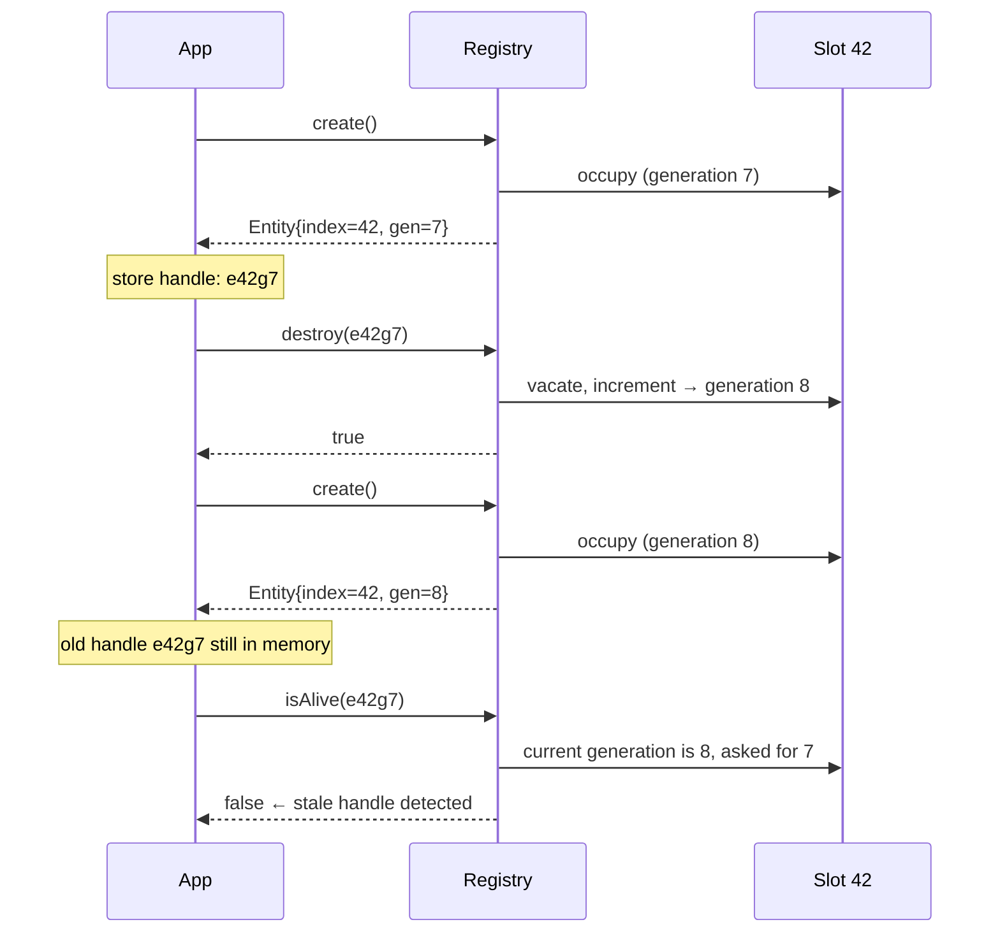
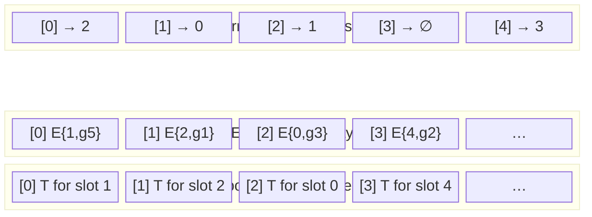

# Companion Guide - fatp-ecs

*FAT-P ECS — February 2026*

---

**Scope:** This guide covers the design philosophy, architectural decisions, and implementation rationale behind fatp-ecs—why it exists, why certain design choices were made, what problems they solve, and where the design creates tension. It explains the composition thesis, the generational entity ID design, the View iteration architecture and the Clang alias-analysis regression that drove its current form, the always-on event system tradeoff, and the parallel scheduler's conflict model.

**Not covered:**
- API reference and usage recipes (see User Manual - fatp-ecs)
- Benchmark methodology and raw data (see README.md)
- FAT-P component internals (see individual FAT-P component Companion Guides)

**Prerequisites:**
- Working knowledge of C++ object lifetime, virtual dispatch, and template metaprogramming
- Understanding of cache hierarchy concepts (cache lines, hardware prefetching, L1/L2/L3)
- Familiarity with the ECS architectural pattern at a conceptual level
- Awareness of compiler alias analysis at a basic level

---

## Companion Guide Card

**Component:** fatp-ecs  
**Design question:** Can a production-quality ECS be built entirely by composing independent FAT-P primitives, without bespoke data structures?  
**Key tradeoff:** Always-on lifecycle events (uniform observability, +3–4 ns per add) vs. opt-in events (zero cost when unused, reduced observability guarantees)  
**Decision made:** Always-on events; the uniformity benefit and debug-ability justify the cost  
**Rejected alternatives:** Archetype-based layout (different locality trade-off; EnTT's sparse-set model is better understood), lock-free event emission (complexity without measured benefit), virtual component iteration (eliminated to maintain EnTT performance parity)  
**Historical context:** Built in a weekend with an AI pair-programmer as a proof-of-concept for the FAT-P composition thesis

---

## Table of Contents

**[Introduction: The Composition Thesis](#introduction-the-composition-thesis)**

### Part I — The Problems

1. [The ECS Problem: Why OOP Fails at Scale](#chapter-1--the-ecs-problem-why-oop-fails-at-scale)
2. [The EnTT Benchmark: Choosing Your Adversary](#chapter-2--the-entt-benchmark-choosing-your-adversary)
3. [The 19-Component Audit: Mapping Primitives to Responsibilities](#chapter-3--the-19-component-audit-mapping-primitives-to-responsibilities)

### Part II — The Architecture

4. [Entity Identity: 64-Bit Generational IDs and ABA Prevention](#chapter-4--entity-identity-64-bit-generational-ids-and-aba-prevention)
5. [Component Storage: The Sparse-Set Design](#chapter-5--component-storage-the-sparse-set-design)
6. [View Iteration: The Alias Analysis Regression](#chapter-6--view-iteration-the-alias-analysis-regression)
7. [The Event System: Always-On vs. Opt-In](#chapter-7--the-event-system-always-on-vs-opt-in)
8. [Groups: Contiguous Layout at the Cost of Ownership](#chapter-8--groups-contiguous-layout-at-the-cost-of-ownership)
9. [Parallel Scheduler: Readers-Writer Analysis Without a Graph](#chapter-9--parallel-scheduler-readers-writer-analysis-without-a-graph)

### Part III — Specific Decisions

10. [The CommandBuffer Problem: Mutation Safety During Iteration](#chapter-10--the-commandbuffer-problem-mutation-safety-during-iteration)
11. [Snapshot: Entity Remapping and the EntityMap Design](#chapter-11--snapshot-entity-remapping-and-the-entitymap-design)
12. [The Store Cache: Flat Array vs. Hash Map for TypeId Lookup](#chapter-12--the-store-cache-flat-array-vs-hash-map-for-typeid-lookup)

### Part IV — Where the Design Loses

13. [Known Limitations and Honest Assessments](#chapter-13--known-limitations-and-honest-assessments)
14. [Rejected Alternatives](#chapter-14--rejected-alternatives)

---

## Introduction: The Composition Thesis

There is a common objection to general-purpose library components: they are too simple. Real software requires tightly integrated, purpose-built structures that understand each other's invariants. A hash map designed for general use cannot match a hash map tuned for a specific access pattern. A signal system designed for general use cannot match an event bus tuned for ECS lifecycle semantics. The argument concludes that general-purpose components produce mediocre composites.

fatp-ecs is a counter-argument.

The hypothesis: if each primitive is individually excellent—not merely adequate, but correct under adversarial conditions, cache-aware, exception-safe, and documented with provable invariants—then a system composed from those primitives will inherit those properties. The integration cost is real (bridging types, managing lifetime, threading policies through the composition), but the foundation is solid in a way that bespoke code often isn't.

The test: build an ECS that is competitive with EnTT, the industry-standard C++ ECS. EnTT is thousands of lines of tightly optimized template code, written over years, benchmarked obsessively. If FAT-P's composition can match or beat it on the operations that matter, the thesis is supported.

The result: fatp-ecs beats EnTT-64 on create, destroy, remove, get, and all iteration benchmarks. It loses on single-component add due to always-on events. The composite is not mediocre.

This companion guide explains the architecture that produced that outcome.

---

## Chapter 1 — The ECS Problem: Why OOP Fails at Scale

The problem that motivates ECS is not conceptual purity. It is cache performance under scale.

In an object-oriented game engine, a `Character` base class has virtual `update()` and `render()` methods. Two thousand enemies, each a derived class, sit on the heap in arbitrary locations. Iterating over them to call `update()` involves two thousand pointer dereferences to reach the object, two thousand vtable pointer loads from each object, two thousand vtable reads to find the function address, and two thousand indirect calls. At each step, the address the CPU needs to fetch is unpredictable—it depends on the runtime type of the object and the heap layout established by thousands of previous allocations.

Modern CPUs are designed around predictable access patterns. The out-of-order execution unit can execute 100-200 instructions in flight simultaneously—but only if it can predict what to fetch next. Virtual dispatch breaks that prediction at every level. The branch predictor cannot predict a call through a function pointer. The hardware prefetcher cannot predict which vtable will be fetched next. The instruction cache cannot stay warm when control flow scatters across derived-class implementations scattered through virtual address space.

Profilers show the consequence: games spending 40–60% of frame time in memory-system overhead, not in gameplay logic.

The ECS answer is structural. Don't store objects; store components in dense arrays. A `Position` array for all positioned entities. A `Velocity` array for all moving entities. When the physics system runs, it iterates the two arrays with a sequential access pattern the hardware prefetcher can follow. The CPU doesn't wait for data; it already fetched it.

The academic version of ECS emphasizes data-oriented design. The practical version emphasizes the downstream consequence: simulations with tens of thousands of entities running at 60 fps on hardware that would have struggled to render a hundred OOP-style entities.

---

## Chapter 2 — The EnTT Benchmark: Choosing Your Adversary

Performance comparisons require a reference point. fatp-ecs chose EnTT-64 as that reference.

EnTT (by Michele "skypjack" Caini) is the most widely used open-source C++ ECS. It is heavily benchmarked, has years of optimization history, and uses the same fundamental architecture—sparse-set component stores—that fatp-ecs uses. Comparing against EnTT measures whether the FAT-P composition approach can reach the performance ceiling established by purpose-built code.

The choice of EnTT-64 rather than EnTT-32 matters. EnTT-32 uses 16-bit entity indices and 16-bit generations; EnTT-64 uses 32-bit indices and 32-bit generations, matching fatp-ecs's layout. Comparing against EnTT-32 would be an unfair advantage—smaller entity IDs mean smaller sparse arrays, which means better cache behavior. The comparison must be apples-to-apples.

The benchmark suite runs on GitHub Actions to control for hardware variability. Round-robin execution with randomized order eliminates ordering bias. Each measurement is the median of 20 batches, not a best-of-N that hides variance. CPU frequency monitoring via FAT-P's `FatPBenchmarkRunner` detects thermal throttling.

The results on GCC-14, N=1M entities:

- **Iteration wins dominate.** The 2-comp and 3-comp iteration ratios (0.33× and 0.38× of EnTT's cost) are the most significant results. Iteration is the hot path in every ECS workload. Being 2.5–3× faster in the operation that runs millions of times per frame has compounding consequences.

- **The add overhead is real and bounded.** fatp-ecs is 1.39× slower than EnTT-64 on single-component add. The entire delta traces to `onComponentAdded<T>` emission. The signal emission check is one branch and one load from a slot-count field. It costs ~3–4 ns on GCC. This is not a micro-optimization opportunity; it is the cost of always-on observability.

- **The wins are structural.** They don't come from micro-tuning the same algorithm; they come from architectural differences that are documented, measurable, and reproducible across all five tested compiler configurations (GCC-13/14, Clang-16/17, MSVC).

---

## Chapter 3 — The 19-Component Audit: Mapping Primitives to Responsibilities

An ECS needs specific capabilities. Mapping those capabilities to FAT-P components is the design work that the composition thesis requires doing carefully.

**Entity allocation with ABA safety.** You need generational IDs. When entity slot 42 is destroyed and a new entity takes that slot, code holding an old handle to slot 42 must fail cleanly. FAT-P's `SlotMap` provides exactly this: slot indices plus generation counters, with `insert_at()` for hint-based creation.

**Component storage with O(1) access and cache-linear iteration.** You need a per-component-type data structure that maps entity IDs to component data in O(1) and iterates densely. FAT-P's `SparseSetWithData` is this structure. The sparse array maps entity indices to dense indices; the dense array holds the component values and the corresponding full 64-bit entity IDs.

**Type-erased component store registry.** The `Registry` needs to manage component stores for arbitrary types T without knowing T at compile time. FAT-P's `FastHashMap` keyed by `TypeId` provides this. When `registry.emplace<Position>(e, ...)` is called, the registry looks up the `ComponentStore<Position>` for `TypeId<Position>`, creating it if it doesn't exist.

**Event emission.** Component and entity lifecycle events need a signal mechanism. FAT-P's `Signal` provides observer-pattern emission with `ScopedConnection` RAII lifetime management. Connecting and disconnecting listeners is O(1) amortized; emission is O(listeners).

**Parallel system execution.** Running systems concurrently on worker threads needs a thread pool with work stealing to avoid idle threads. FAT-P's `ThreadPool` provides this. The `Scheduler` uses FAT-P's `BitSet` for component mask intersection to determine which systems conflict.

**Type safety for entity IDs.** Entities are 64-bit integers. Without a wrapper, code can accidentally treat an entity ID as an array index, a component ID, or an arbitrary integer. FAT-P's `StrongId` provides a zero-overhead type-safe wrapper with configurable arithmetic policies. The `Entity` type uses `UncheckedOpPolicy` (no overflow checks—the allocator controls validity) and `NoCheckPolicy` (no construction validation—Entities are only created by the Registry).

The mapping is not forced. Each FAT-P component was an organic fit for the ECS problem it solves. This is the composition thesis in practice: components designed independently converge on solving real problems when assembled into a system that has those problems.

---

## Chapter 4 — Entity Identity: 64-Bit Generational IDs and ABA Prevention

The entity ID is the most fundamental design decision in an ECS. Everything else—component stores, views, groups, snapshots—is indexed by entity IDs. Getting the ID design wrong propagates errors everywhere.

### The ABA Problem in Entity Allocation

Suppose entity IDs are simple sequential integers. Entity 42 is created, used, and destroyed. Its slot is returned to the allocator. Later, entity 42 is created again—it reuses slot 42. Now any code that was holding a reference to the old entity 42 is pointing at the new entity 42 without knowing it.

This is the ABA problem: a pointer or handle that was valid, became invalid, and then became valid again pointing at different data. Code that cached the old entity 42's component values, expecting them to remain associated with that entity, silently reads the new entity 42's data. No crash; wrong behavior.

Generational IDs prevent this. The entity ID encodes both a slot index (which determines where in the sparse array the entity lives) and a generation counter (which increments each time a slot is reused). When code asks `isAlive(entity_42_generation_7)`, the registry checks whether slot 42's current occupant has generation 7. If slot 42 is now occupied by generation 8, the check returns false. The handle is correctly identified as stale.



### The 64-Bit Choice

EnTT-32 uses 16 bits for the index and 16 bits for the generation. This limits concurrent entities to 65,536 and generation reuse detection to 65,536 generations before wraparound. For small games, this is fine.

fatp-ecs uses 32 bits for the index (up to 4 billion concurrent entities) and 32 bits for the generation (4 billion reuse cycles before wraparound). The consequence is larger entity IDs (8 bytes vs. 4) and larger sparse arrays. The tradeoff is correctness and capacity for large-scale simulations.

The packing is `generation << 32 | index`—lower 32 bits are the index, upper 32 bits are the generation. Extracting the index is a mask; extracting the generation is a right-shift. Both are single instructions.

### The EntityTraits Adapter

`SparseSet<Entity, EntityIndex>` needs to map an `Entity` value to a sparse array index. The sparse array is indexed by slot index (32 bits), not by the full 64-bit entity value. The `EntityIndex` policy provides this mapping:

```cpp
struct EntityIndex {
    using sparse_index_type = uint32_t;
    static constexpr uint32_t index(const Entity& entity) noexcept {
        return static_cast<uint32_t>(entity.get() & 0xFFFFFFFF);
    }
};
```

This allows the sparse set to store full 64-bit `Entity` values in its dense array (preserving the generation for later validation) while indexing the sparse array by the 32-bit slot index only.

The critical invariant: dense iteration always reads full 64-bit entities from `ComponentStore::entities()`, never reconstructs them from sparse array indices. An index alone is not an entity.

---

## Chapter 5 — Component Storage: The Sparse-Set Design

### Why Sparse Sets Beat Alternatives

The canonical alternatives to sparse-set component storage are:

**Sorted arrays with binary search.** O(log N) per lookup, O(N) iteration. Acceptable for small N; unacceptable for large N.

**Hash maps.** O(1) average lookup, but with cache misses per probe and no dense iteration guarantee. The `FastHashMap` in the registry stores component store pointers (one entry per type), not component data. Using a hash map for per-entity component lookup would thrash the cache.

**Archetypes.** Entities are grouped by their exact component combination. All entities with {Position, Velocity} live in one archetype; all entities with {Position, Velocity, Health} live in another. Adding a component moves an entity from one archetype to another—expensive mutation. Iteration is sequential within each archetype but requires iterating multiple archetypes for queries that span combinations. Flecs uses archetypes; EnTT does not.

The sparse-set design (`SparseSetWithData`) provides O(1) for all four critical operations:

- **Add:** Append to dense array; write index to sparse slot. Two array writes.
- **Remove:** Swap the target with the last dense entry; update the swapped entry's sparse slot; decrement the count. Two array reads, three array writes.
- **Get:** Read the sparse slot to get the dense index; index the dense array. Two array reads.
- **Iterate:** Walk the dense array sequentially. One sequential read per step.

The dense array is the access pattern that hardware prefetching loves: sequential, predictable, full cache-line utilization.

### The Parallel Entity Vector

`ComponentStore<T>` extends `SparseSetWithData` with a parallel entity vector—a dense array of `Entity` values that mirrors the component data array. Position `i` in the component array corresponds to position `i` in the entity array.

Why store entities redundantly? The sparse set's dense "key" array holds 64-bit entity values. The component data array holds `T` values. During iteration, you need both: the entity (for the callback) and the component data (to modify). Storing them in parallel arrays rather than interleaved structs keeps the data access patterns independent: iterating entities loads from one array, iterating component data loads from another, and the CPU's multiple cache ports can fetch from both simultaneously.



`sparse[slotIndex]` → dense index. `entities[denseIndex]` → full 64-bit Entity (index + generation). `data[denseIndex]` → component value. Both dense arrays are walked sequentially during iteration; the sparse array is accessed only for random-access `get()` and `has()` queries.

The entity vector is kept in sync with the data array through `SparseSetWithData::indexOf()`, which enables mirroring the swap-with-back erasure pattern during `remove()`.

---

## Chapter 6 — View Iteration: The Alias Analysis Regression

This chapter documents a performance bug that was found, diagnosed to its root cause, and fixed. It is included here because the fix—pre-caching store pointers before the iteration loop—is non-obvious, and the rationale for it appears only in the `View.h` source comments. The bug affected multi-component iteration on Clang-16 and Clang-17.

### The Setup

A `View<Position, Velocity>` iterates the smaller store (say, `Velocity`) and checks each entity against the larger store (`Position`). For each entity in the pivot, the view calls `position_store.has(entity)` and, if true, `position_store.getUnchecked(entity)`.

Both `has()` and `getUnchecked()` are short methods that read fields from the store's internal `std::vector`: the data pointer, the size, and the sparse array. The compiler is expected to hoist these reads out of the loop—load them once before the loop begins, keep them in registers throughout.

### What Clang Did Instead

Clang's alias analysis saw a problem. The loop body calls the user's lambda with a mutable reference to the component data: `func(entity, position_ref, velocity_ref)`. From Clang's perspective, that lambda could write to any memory address—including the internal fields of the `std::vector` objects inside the stores.

The lambda receives `Position&` and `Velocity&`. The `std::vector`'s internal data pointer and size fields are also `Position*` and `size_t` values living somewhere in memory. Clang's alias analysis could not prove that writing through `position_ref` would not modify the vector's metadata fields. It therefore refused to hoist the vector metadata reads out of the loop. Every iteration reloaded the vector's data pointer and size from memory.

The consequence: 8–10 extra memory loads per entity in the 2-comp and 3-comp cases. At N=1M, this is a measurable regression.

### The Fix

The fix is in `View.h`, in a method called `eachWithPivot`. Before the loop begins, raw pointers extracted from every non-pivot store are stored in local variables:

```cpp
// Pre-cache store pointers into stack-local variables before the loop.
// Stack-local pointer variables are provably unaliased from any store's
// internal data. Clang (and GCC) can hoist these to registers for the
// duration of the loop with no per-iteration reloads.
auto* pos_data   = position_store.dataPtr();
auto* pos_sparse = position_store.sparsePtr();
const size_t pos_count = position_store.size();
```

Stack-local variables have a property the vector fields don't: they cannot be aliased by `Position&` or `Velocity&` references. The address of a stack variable is the address of the stack frame; it cannot overlap with heap-allocated component data. Clang's alias analysis proves this and hoists the loads.

The iteration win in the benchmarks (2-component: 0.33× of EnTT's cost; 3-component: 0.38×) is partly attributable to this fix. The fix is architectural—it applies uniformly to all multi-component view queries—not a per-component micro-optimization.

### Why This Didn't Affect GCC

GCC's alias analysis is more conservative in the other direction: it is more willing to assume the lambda doesn't alias the vector metadata, so it hoists the loads anyway. The fix has no negative impact on GCC; it simply makes Clang produce the same code GCC was already producing.

---

## Chapter 7 — The Event System: Always-On vs. Opt-In

### EnTT's Design

In EnTT, lifecycle event connections are opt-in. `registry.on_construct<T>()` returns a signal that you connect to. If nobody calls `on_construct<T>()`, the signal is never consulted during `emplace<T>()`. The cost of events for unobserved types is zero.

This is efficient but asymmetric: types that need observation are fundamentally different from types that don't. The registry must track whether a signal exists for each type, and the fast path (no listeners) diverges from the slow path (listeners exist) at the implementation level.

### fatp-ecs's Design

fatp-ecs emits lifecycle events unconditionally. `emplace<T>()` always checks `mEvents.onComponentAdded<T>().slotCount()` and emits if non-zero. The check is one load and one branch, with branch prediction strongly favoring the zero case after the first iteration.

The cost is non-zero: ~3–4 ns per add on GCC. But the benefit is uniformity.

### The Uniformity Argument

Consider a debugging scenario. You want to trace every time an entity acquires a `Position` component. In EnTT, you can connect a listener at any time. In fatp-ecs, you can do the same—but the guarantee is stronger: you cannot have "missed" any events that happened before you connected. The signal infrastructure was already in place; there was no window where events were silently dropped because no listener was connected.

Consider a testing scenario. You write a test that verifies an observer pattern fires correctly when components are added. In fatp-ecs, the test infrastructure (connecting listeners, observing events) works identically to production code. There is no "events are disabled by default" mode that you need to explicitly enable in tests.

Consider a debugging tool scenario. An editor inspector wants to display every component type that exists on any entity. With always-on events, connecting listeners at editor startup catches every future add/remove without coordinating with each system that might add or remove components.

### The Cost in Context

The 3–4 ns per add is real. At 100,000 component adds per frame at 60 fps, that's 18–24 ms of event overhead per second—18–24% of total frame budget at 60 fps. For workloads that add components heavily every frame (streaming systems, procedural generation), this overhead is a constraint to design around.

For workloads that add components at initialization time and then iterate, the per-add overhead is a startup cost, not a sustained cost. The iteration wins (0.33× to 0.40× of EnTT's cost in multi-component cases) dominate.

The design choice is a tradeoff, not an error. A configuration option (opt-out events) was rejected because it would make the event system behavior dependent on a preprocessor flag, complicating the mental model and test coverage.

---

## Chapter 8 — Groups: Contiguous Layout at the Cost of Ownership

### The Iteration Asymmetry

Views and groups solve the same problem—iterating entities with multiple components—but with different trade-offs.

A `view<Position, Velocity>` iterates the smaller store and probes the larger. Each entity in the pivot requires a sparse-array lookup in every non-pivot store. The lookup is O(1)—two array reads—but it's a random access pattern: the entity's slot index is used to index the sparse array, and different entities have different slot indices with no sequential relationship.

An owning `group<Position, Velocity>` sorts both stores so that the entities with both components occupy a contiguous prefix in each store's dense array. Iteration walks that prefix with no probing at all—just two sequential array reads per entity.


The group wins in a specific scenario: when the same component set is iterated every frame and the intersection is large. If 95% of entities with Position also have Velocity, the view's probing cost is nearly identical to the group's sequential cost. The group's advantage is clearest when the intersection is smaller—say, 10% of Position entities also have Velocity—because the group eliminates the probe overhead for the 90% misses.

### The Ownership Constraint

Groups enforce an invariant: the first N entries of each owned store's dense array are exactly the entities that have all owned components. Maintaining this invariant requires that every `emplace<T>()` and `erase<T>()` on an owned component type checks whether the invariant is affected and, if so, swaps entries to restore it.

This maintenance cost is O(1) per mutation—a constant number of swaps—but it is incompatible with two groups owning the same component type. If `group<A, B>` owns A and `group<A, C>` also owns A, they each want to arrange A's dense array differently. The invariants are mutually exclusive.

The registry enforces this with an assertion at group creation time. The error is clear and immediate; there is no silent data race or delayed failure.

### Non-Owning Groups

The non-owning group variant provides the group iteration interface without the ownership constraint. It does not sort the stores; it iterates by probing like a view. The benefit over a plain view is code organization—you can write `registry.non_owning_group<A, B>()` to signal intent that you want group-like access, and upgrade to an owning group later if profiling shows the probe cost dominates.

---

## Chapter 9 — Parallel Scheduler: Readers-Writer Analysis Without a Graph

### The Problem

Parallel system execution requires knowing which systems can run simultaneously without producing data races. Two systems conflict if one writes a component that the other reads or writes.

The formal model for this is a dependency graph: systems are nodes, conflicts are directed edges, and topological sort determines the execution order. Systems that have no path between them in the graph can run concurrently.

Dependency graphs work well for complex workloads with many systems and intricate dependency relationships. They are expensive to build and maintain for simpler workloads.

### The Greedy Batch Model

fatp-ecs uses a simpler model: greedy batching. Each system declares a write mask (BitSet of component TypeIDs it writes) and a read mask (BitSet it reads). Two systems conflict if any of these conditions hold:

- System A's write mask intersects System B's read mask (A writes what B reads)
- System A's write mask intersects System B's write mask (both write the same component)
- System B's write mask intersects System A's read mask (B writes what A reads)

This is the classic readers-writer analysis. The `conflictsWith()` method on `SystemDescriptor` implements it as three BitSet intersection checks.

The scheduler greedily collects the largest non-conflicting subset of remaining systems, submits that batch to the ThreadPool, waits for completion, and repeats. The batch partition is recomputed each call to `run()`.

Using the three systems declared in the User Manual (Physics writes Position/reads Velocity; AI writes AI/reads Position; Render reads Position+Sprite):

```mermaid
gantt
    title scheduler.run() — one frame
    dateFormat X
    axisFormat %s

    section Batch 1 (parallel)
    Physics  [writes Position]   : 0, 3
    Render   [reads Position]    : 0, 2

    section Batch 2 (sequential — waits for Batch 1)
    AI  [writes AI, reads Position] : 3, 5
```



Physics and Render are non-conflicting: Render only reads Position, and Physics writes it—but there is no write-write conflict and the reads-writer rule only blocks when another system *writes* the same component a reader depends on. AI conflicts with Physics (both access Position, and AI reads what Physics writes), so AI runs in a separate batch after Batch 1 completes.

This is O(N²) in the number of systems—for each system, check against all others—but N is typically small (10–50 systems). The scheduling overhead is negligible compared to the work performed.

### What the Model Misses

The greedy model is conservative. Two systems that access different entities of the same component type don't actually conflict—a physics system processing entities 0–499 and another processing entities 500–999 both writing Position never actually write the same memory. But the scheduler cannot know this without entity-range information, which systems don't declare.

The practical consequence: entity-partitioned parallelism requires the application to use the `parallel_for` primitive (which explicitly partitions the dense array) rather than declaring two systems with the same write mask.

The scheduler also doesn't model ordering requirements that aren't conflict requirements. If "Render" must run after "Physics" even though they don't share components, the application must express this by making Render depend on a dummy component that Physics writes—or by running them in separate `run()` calls.

---

## Chapter 10 — The CommandBuffer Problem: Mutation Safety During Iteration

### Why It Matters

`view<Health>().each(lambda)` iterates `ComponentStore<Health>`'s dense array. The array is a `std::vector<Health>`. If the lambda calls `registry.destroy(e)`, the destroy implementation walks every component store looking for `e` and removes it. For the `Health` store, this is a swap-with-back and a size decrement. The iterator's current position and end pointer are now invalid.

This is not a hypothetical edge case. Destroy-on-zero-health inside a health-iteration loop is one of the most common ECS patterns. It also crashes without a CommandBuffer.

### The CommandBuffer Architecture

`CommandBuffer` stores commands as `std::vector<Command>`, where each `Command` holds a `CommandKind`, an optional `Entity`, and a `std::function<void(Registry&)>` for the actual operation. The `std::function` captures the arguments needed for the deferred operation.

`flush(registry)` processes the command vector sequentially, calling each command's apply function. The loop is over the command vector, not over any component store—it is safe against arbitrary mutations.

### The Circular Dependency

`CommandBuffer` needs to call `registry.create()`, `registry.destroy()`, `registry.emplace<T>()`, and `registry.erase<T>()`. But `Registry.h` includes `CommandBuffer.h` (to provide the `CommandBuffer` type for user-facing API). If `CommandBuffer.h` included `Registry.h`, you'd have a circular include.

The resolution: `CommandBuffer.h` declares the methods but defers their implementations to `CommandBuffer_Impl.h`, which includes `Registry.h`. The umbrella header `FatpEcs.h` includes everything in the correct order. This pattern is documented in `DEVELOPMENT_GUIDELINES.md` as the canonical circular dependency resolution for this codebase.

### ParallelCommandBuffer

`ParallelCommandBuffer` replaces the `std::vector<Command>` with a mutex-protected queue. Multiple threads can record commands simultaneously; `flush()` processes them in recording order. The mutex only serializes the recording of each command (a `std::function` construction and a push), not the commands themselves.

For high-volume parallel mutation, per-thread `CommandBuffer` instances with a merge step at flush time would be faster—but the current design is simpler and sufficient for the expected pattern (a small number of mutations per thread per frame).

---

## Chapter 11 — Snapshot: Entity Remapping and the EntityMap Design

### The Remapping Problem

Serializing a registry is straightforward: write the entity IDs, write the component data. Deserializing it is the hard part.

When you restore a snapshot into a new registry, you call `registry.create(hint)` for each saved entity, attempting to recreate the entity at the same slot index. If the slot is available, you succeed. If not—because the registry already has entities, or because you're loading into a registry that was modified after saving—you get a different slot.

Components that reference other entities (a `Parent` component holding the parent's entity ID, a `Target` component holding an enemy's ID) now hold stale IDs. The stored ID referred to slot 42 in the old registry; in the new registry, slot 42 may be a different entity or empty.

### The EntityMap Solution

`EntityMap` is a hash map from old entity ID to new entity ID, built during the restore process as each entity is recreated. The `RegistrySnapshotLoader` populates it: when old entity E_old is recreated as E_new, the mapping `E_old → E_new` is recorded.

When deserializing component data, the callback receives a `const EntityMap&`. For any component field that stores an entity reference, the callback calls `remap.translate(old_id)` to get the corresponding new ID:

```cpp
loader.deserializeComponent<Parent>(dec,
    [](fat_p::binary::Decoder& d, const EntityMap& remap) -> Parent {
        Entity old(d.readRaw<uint64_t>());
        return Parent{ remap.translate(old) };
    });
```

This is a complete, general solution to cross-entity reference integrity. The callback handles the remapping; the snapshot machinery doesn't need to know which component fields are entity references.

### Why Callbacks Instead of Reflection

The alternative to user-provided callbacks is automatic reflection: the snapshot serializes and deserializes component data by reflecting on its fields, identifying entity-typed fields, and remapping them automatically.

Reflection in C++20 requires either macros, external code generation, or a compiler extension. fatp-ecs has no macro system and no code generation step. Callbacks are simpler, zero-dependency, and put the remapping logic in the hands of the code that knows which fields are entity references.

The cost: every component type you want to snapshot must have explicit serialization and deserialization callbacks. This is verbose but correct. A missed entity reference in a callback is a logic error in the callback, not a silent snapshot corruption.

---

## Chapter 12 — The Store Cache: Flat Array vs. Hash Map for TypeId Lookup

### The Hot Path

`registry.emplace<T>(e, ...)` needs to find or create the `ComponentStore<T>` for type T. The stores are keyed by `TypeId`—a small integer assigned sequentially as types are first encountered. The primary store map is `FastHashMap<TypeId, unique_ptr<IComponentStore>>`.

For a registry with 20 component types and one million entities, `emplace<Position>` is called one million times. Each call probes the hash map. The hash map is fast (FAT-P's `FastHashMap` uses open addressing), but it's still a hash computation and a conditional branch per call.

### The Cache Design

The registry maintains a flat array `mStoreCache[64]` of `IComponentStore*` values. If a type's TypeId is less than 64, the cache holds a direct pointer to its store. The lookup for cached types is:

```cpp
if (tid < kStoreCacheSize && mStoreCache[tid] != nullptr)
    return static_cast<TypedIComponentStore<T>*>(mStoreCache[tid]);
```

This is one comparison, one load, one comparison, and one return. No hash computation. No probe sequence. No branch prediction uncertainty.

The constant 64 was chosen as a practical ceiling on the number of component types in most real applications. The first 64 types registered get cached; types 65 and beyond fall through to the hash map. This is not a semantic limit; it is a performance optimization with a graceful fallback.

### Why Not a Larger Cache?

Larger caches trade memory for probe speed. A cache of 256 entries would cover more types but occupies 256 × 8 = 2KB—a meaningful fraction of a 32KB L1 cache. A registry that lives in L1 is faster for everything; a registry that gets evicted from L1 because its cache is too large pays for it across all operations.

The value 64 was not formally optimized; it was chosen as a reasonable default based on common component counts. An application with more than 64 hot component types could adjust the constant.

---

## Chapter 13 — Known Limitations and Honest Assessments

### Component Type Count

All component stores share the same `TypeId` space, which is global-process. TypeIds are assigned sequentially the first time a type is used anywhere in the process. In a large application with many component types across many translation units, TypeIds may exceed 64, reducing the flat-array cache hit rate. This degrades get/emplace performance for high-numbered types from array-index speed to hash-map speed.

### No Archetype Layout

fatp-ecs uses a sparse-set layout. Archetypes (used by Flecs and others) pack all components for an entity together in one contiguous block. This is better for workloads that need all of an entity's components simultaneously; sparse sets are better for workloads that process one component type at a time across many entities. Most game loop workloads favor the latter. But applications with many component types and few entities may see different results.

### Always-On Event Overhead

The 3–4 ns per add on GCC is measured, consistent, and will not be optimized away without removing the always-on events themselves. Applications that add millions of components per frame (streaming, procedural generation) should budget for this overhead explicitly.

### Single-Registry Model

fatp-ecs has one global `TypeId` sequence. Running two registries in the same process with different component type sets is supported, but TypeIds are shared globally. Components with the same TypeId in different registries are different types only at the C++ type level; at runtime, they share the same integer. This is correct but means the flat-array cache fills with types from all registries.

### Thread Safety

`Registry` is explicitly not thread-safe. `Scheduler` provides the supported path for parallel access. Manual concurrent access to the same registry instance—without going through the Scheduler's conflict analysis—will produce data races and is not supported.

---

## Chapter 14 — Rejected Alternatives

### Archetype-Based Storage

Archetypes group entities by their exact component set. Adding a component moves an entity from one archetype to another. Iteration is sequential within archetypes with no probe overhead. 

The rejection: archetype mutation is more expensive than sparse-set mutation for typical game workloads where components are added and removed frequently. EnTT's sparse-set design has years of validation across many game production projects. Replicating EnTT's performance baseline with sparse sets is more tractable than replicating it with archetypes.

### Lock-Free Event Emission

Replacing the `std::mutex` in `Signal` with a lock-free data structure for the slot list would eliminate synchronization overhead in the signal emission path. The measured cost of signal emission (one branch, one load from a count field, and—when listeners exist—iteration over a SmallVector) is already small. Lock-free alternatives add implementation complexity without a demonstrated bottleneck.

### Virtual Component Iteration Interface

An earlier design explored a virtual `IComponentStore::iterate(visitor)` interface that would allow the registry to dispatch iteration generically. This was rejected when benchmarks showed that virtual dispatch in the iteration hot loop—two table lookups and an indirect call per entity—was measurable overhead at N=1M. The current design uses template instantiation to generate specialized iteration code per component type combination, achieving fully inlined loops.

### Compile-Time Component Registration

Some ECS frameworks require components to be registered at compile time via a centralized type list. This enables static component masks and fully compile-time group definitions. The cost is rigidity: adding a component type requires modifying the registration list, which may trigger long recompilation. fatp-ecs uses runtime TypeId assignment (first use wins) for flexibility at the cost of no static component mask optimization.

---

*fatp-ecs — built from FAT-P components*
