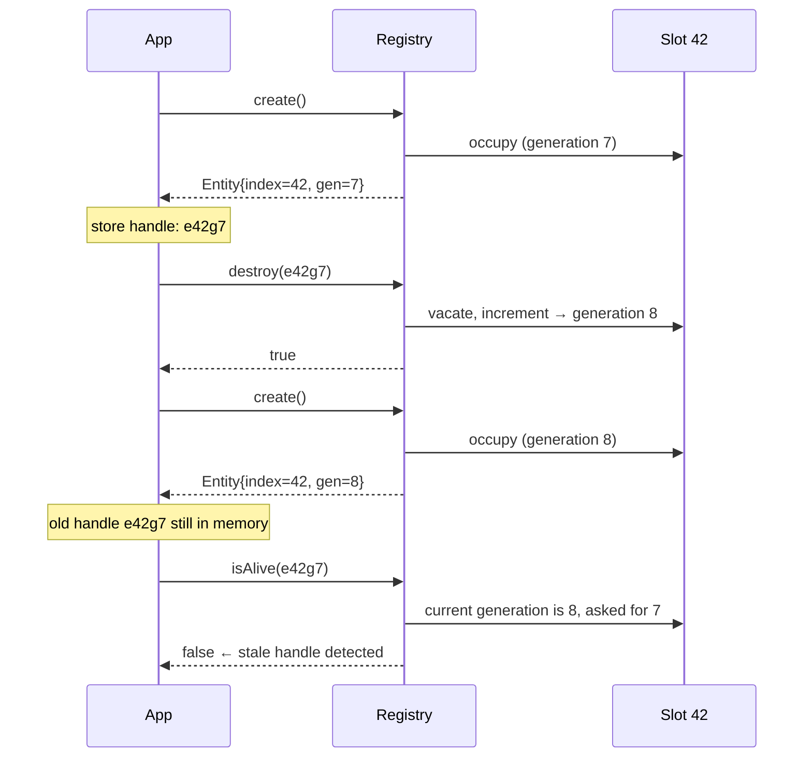
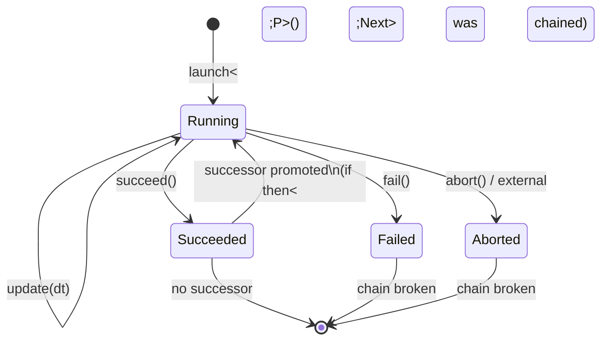

# User Manual - fatp-ecs

*Updated February 2026*

---

**Scope:** Complete usage guide for fatp-ecs: entity lifecycle, component storage, Views, Groups, lifecycle signals, Observers, CommandBuffer, Snapshot, parallel Scheduler, ProcessScheduler, Handle, context storage, entity templates, entity names, and gameplay math utilities.

**Not covered:**
- Internal architecture decisions (see Companion Guide - fatp-ecs)
- Benchmark methodology and raw data (see README.md performance tables)
- FAT-P component internals (see individual FAT-P component manuals)

**Prerequisites:** C++20; no prior ECS knowledge assumed; understanding of cache effects is helpful but not required

---

## User Manual Card

**Component:** fatp-ecs
**Primary use case:** Manage thousands of heterogeneous entities and iterate over component subsets with cache-linear throughput
**Integration pattern:** Include `<fatp_ecs/FatpEcs.h>`, instantiate `Registry`, create entities with `create()`, attach components with `emplace<T>()`, iterate with `view<Ts...>().each()`
**Key API:** `Registry`, `Entity`, `View`, `OwningGroup`, `Observer`, `CommandBuffer`, `RegistrySnapshot`, `Scheduler`, `ProcessScheduler`, `Handle`
**std equivalent:** None
**Migration from EnTT:** Namespace swap (`entt::` → `fatp_ecs::`), header swap, `entt::exclude<Xs>` → `Exclude<Xs>{}` at call sites; all method names identical
**Common mistakes:** Mutating the registry inside `view.each()` without a CommandBuffer; forgetting that groups have exclusive ownership of component types; comparing bare entity indices across registry instances without the generation field
**Performance notes:** O(1) add/remove/get/create/destroy. Iteration is dense-array sequential. For multi-component iteration, always prefer `view<A, B>` over nested single-component loops. Use owning groups when one component subset is iterated with the same set every frame.

---

## Table of Contents

1. [The ECS Data Model](#the-ecs-data-model)
2. [Getting Started](#getting-started)
3. [Entity Lifecycle: IDs, Generations, and the ABA Problem](#entity-lifecycle-ids-generations-and-the-aba-problem)
4. [Component Operations](#component-operations)
5. [Views: Iterating Entities the Right Way](#views-iterating-entities-the-right-way)
6. [Owning Groups: Eliminating the Probe](#owning-groups-eliminating-the-probe)
7. [Non-Owning Groups](#non-owning-groups)
8. [Lifecycle Signals: Always-On Observability](#lifecycle-signals-always-on-observability)
9. [Observers: Accumulating Changes Between Frames](#observers-accumulating-changes-between-frames)
10. [CommandBuffer: The Mutation Safety Problem](#commandbuffer-the-mutation-safety-problem)
11. [Snapshot: Saving and Restoring the World](#snapshot-saving-and-restoring-the-world)
12. [Parallel Scheduler: Running Systems Concurrently](#parallel-scheduler-running-systems-concurrently)
13. [Process Scheduler: Multi-Frame Behaviors](#process-scheduler-multi-frame-behaviors)
14. [Handle: Single-Entity Access Without Noise](#handle-single-entity-access-without-noise)
15. [Context Storage: Singleton State in the Registry](#context-storage-singleton-state-in-the-registry)
16. [Entity Templates: Data-Driven Spawning](#entity-templates-data-driven-spawning)
17. [Entity Names](#entity-names)
18. [Gameplay Math: SafeMath](#gameplay-math-safemath)
19. [Storage Policies](#storage-policies)
20. [Runtime Views](#runtime-views)
21. [Enumeration and Orphan Detection](#enumeration-and-orphan-detection)
22. [Sorting Component Stores](#sorting-component-stores)
23. [Feature Flags](#feature-flags)
24. [Migration from EnTT](#migration-from-entt)
25. [Troubleshooting](#troubleshooting)
26. [API Reference](#api-reference)

---

## The ECS Data Model

Before writing any fatp-ecs code, it pays to understand what the library actually stores and how it organizes memory. This shapes everything: why views are written the way they are, why you can't mutate inside a loop, why groups exist at all.

### The Problem with Objects

The classic game-engine approach stores entities as objects. A `Character` class has fields for position, health, and AI state. Subclasses override `update()` for their specific behavior. You maintain a `vector<Character*>` and call `update()` on each.

This breaks down at scale because of how modern CPUs work. A cache line is 64 bytes. When you fetch one byte from memory, you get the surrounding 64 bytes for free — but only if those 64 bytes are actually related to your next access. When `update()` dispatches through a virtual table, the CPU fetches the vtable pointer from one location, loads the function address from another, and then executes code that was already pushed out of the instruction cache by the last object's different `update()` implementation. For two thousand enemies, this is two thousand unpredictable branches and two thousand potential cache misses per frame.

ECS inverts the model. Entities are not objects; they are integer IDs. Components are plain data — `struct Position { float x, y; }` — stored in dense arrays, one array per component type. All `Position` values are packed together. All `Velocity` values are packed together. A physics system that wants to move entities reads from two sequential arrays. The hardware prefetcher sees the pattern and loads the data before the CPU asks for it.

### What the Registry Stores

The `Registry` is the central object. It owns:

- An **entity allocator** (the `SlotMap`): a list of live entity slots, each with a generation counter to detect stale references.
- A **component store map**: one `ComponentStore<T>` per component type T that has ever been used. Each store is a sparse set — a sparse array that maps entity slot indices to dense indices, plus a dense array of the T values themselves.
- An **event bus**: signals for component add, remove, and update, fired synchronously on every operation.

The component stores are the hot path. When you call `registry.view<Position, Velocity>().each(f)`, the view walks the dense array of the smaller store, checks each entity against the sparse array of the larger store, and calls `f` only for entities present in both. The entire inner loop operates on contiguous memory.

### What an Entity Is

An entity is a 64-bit integer. The lower 32 bits are a slot index — where in the sparse arrays this entity's components live. The upper 32 bits are a generation counter — a number that increments each time the slot is reused, so that any reference to an old occupant of the slot can be detected.

```cpp
Entity e = registry.create();
// e.get() == 0x0000'0001'0000'0042
//             ─────────── ───────────
//             generation  slot index
```

You never construct an `Entity` value manually. The registry allocates them; you store and pass them.

---

## Getting Started

### Installation

fatp-ecs is header-only. It requires C++20 and FAT-P as a sibling directory or via `FATP_INCLUDE_DIR`:

```bash
# Place FAT-P (FatP/) and fatp-ecs (fatp-ecs/) as siblings.
cmake -B build -DFATP_INCLUDE_DIR=../FatP/include
cmake --build build --config Release
```

### The Umbrella Header

All fatp-ecs types are available from one header:

```cpp
#include <fatp_ecs/FatpEcs.h>
using namespace fatp_ecs;
```

The umbrella header includes everything in the correct order, resolving circular dependencies via `_Impl.h` files for `CommandBuffer` and `EntityHandle`. Do not include individual headers in isolation.

### Your First Registry

```cpp
#include <fatp_ecs/FatpEcs.h>
using namespace fatp_ecs;

struct Position { float x, y; };
struct Velocity { float dx, dy; };

int main() {
    Registry registry;

    Entity e = registry.create();
    registry.emplace<Position>(e, 0.f, 0.f);
    registry.emplace<Velocity>(e, 1.f, 0.5f);

    registry.view<Position, Velocity>().each(
        [](Entity ent, Position& pos, Velocity& vel) {
            pos.x += vel.dx;
            pos.y += vel.dy;
        });

    registry.destroy(e);
    return 0;
}
```

This is the complete lifecycle: create an entity, attach components, iterate with a view, destroy. Everything else in this manual is elaboration on these four operations.

---

## Entity Lifecycle: IDs, Generations, and the ABA Problem

### The Slot Reuse Problem

Entity IDs need to be reusable. If you create and destroy a million entities over the course of a game, you don't want the slot index counter to grow to a million — that would mean a sparse array of size one million even if only a thousand entities are alive at any moment.

So the allocator recycles slots. When entity at slot 42 is destroyed, slot 42 goes back into the free list. The next `create()` may hand out slot 42 again.

This creates a hazard. Suppose you store an entity reference in a `Parent` component:

```cpp
struct Parent { Entity parent; };

Entity child = registry.create();
Entity parent = registry.create();
registry.emplace<Parent>(child, parent);

registry.destroy(parent);            // parent is dead; slot freed

Entity new_entity = registry.create(); // Reuses parent's old slot

// Later:
auto& p = registry.get<Parent>(child);
bool alive = registry.isAlive(p.parent);  // ← Is this true or false?
```

Without protection, `p.parent` still contains the old slot index. The slot is occupied by `new_entity`. `isAlive()` would return `true`, and `registry.get<Position>(p.parent)` would silently return `new_entity`'s position. Wrong answer, no crash, no diagnostic.

This is the ABA problem: a handle that was valid (A), became invalid (B), then appears valid again (A) because the same slot was reused.

### The Generation Counter Solution

fatp-ecs packs a generation counter into every entity ID. The lower 32 bits are the slot index; the upper 32 bits increment each time the slot is reused.



`isAlive()` compares the stored generation in the entity value against the current generation in the slot. If they differ, the handle is stale. No silent corruption.

The consequence for your code: always check entity validity before using a stored entity reference, or use lifecycle events to learn when an entity is destroyed so you can clean up references proactively.

### Creating Entities

```cpp
Entity a = registry.create();
Entity b = registry.create();
// a and b have different slot indices
```

### Hint-Based Creation

`create(hint)` attempts to allocate the same slot index as `hint`. The snapshot system uses this to restore entities at their original slot indices so that sparse arrays don't need to be rebuilt:

```cpp
Entity saved = Entity(/* from binary buffer */);
Entity restored = registry.create(saved);
// restored has the same slot index as saved (if slot was available)
// generation will differ; EntityMap tracks the mapping either way
```

If the slot is unavailable, `create(hint)` allocates a different slot.

### Destroying Entities

`destroy(entity)` removes all components from the entity, fires `onComponentRemoved<T>` for each type present, fires `onEntityDestroyed`, and returns the slot to the allocator:

```cpp
bool wasAlive = registry.destroy(player);
```

### Entity Validity

```cpp
registry.valid(entity)   // true if entity is alive (alias for isAlive)
registry.isAlive(entity) // same
registry.alive()         // count of live entities
registry.entityCount()   // alias for alive()
```

---

## Component Operations

### Adding Components

`emplace<T>()` constructs T directly in the component store's dense array. The component is accessible immediately. `on_construct<T>` fires before `emplace()` returns.

```cpp
// Construct in place (preferred)
registry.emplace<Position>(e, 1.0f, 2.0f);
registry.add<Position>(e, 1.0f, 2.0f);      // emplace alias

// Construct if absent, replace if present
registry.emplace_or_replace<Velocity>(e, 0.5f, 0.f);
```

`emplace()` asserts that T is not already present on the entity. If you're unsure whether the component exists, use `emplace_or_replace()`.

### Replacing and Patching

When you want to modify a component that already exists, use `patch()` to modify it in-place or `replace()` to overwrite it entirely. Both fire `on_update<T>`.

```cpp
// Modify in-place via lambda (T must already exist)
registry.patch<Health>(e, [](Health& h) { h.current -= 10; });

// Fully replace — T must already exist
registry.replace<Health>(e, 100, 100);

// Fire on_update without modifying (useful to notify listeners)
registry.patch<Health>(e);
```

Prefer `patch()` over `get()` + direct mutation when you want `on_update` to fire. Direct mutation through a reference obtained from `get()` bypasses the event system.

### Removing Components

```cpp
// Asserting remove (asserts T is present)
registry.erase<Poison>(e);

// Non-asserting remove (returns true if present)
bool wasPresent = registry.remove<Frozen>(e);
```

`on_destroy<T>` fires immediately before the component is destroyed, while the component data is still valid. Use `on_destroy` listeners if cleanup logic needs to read the component's current values.

### Querying Presence

```cpp
registry.has<Position>(e)                    // true if e has Position
registry.contains<Position>(e)               // EnTT-compatible alias

registry.all_of<Position, Velocity>(e)       // true if e has ALL listed types
registry.any_of<Frozen, Stunned>(e)          // true if e has ANY listed type
registry.none_of<Dead, Disabled>(e)          // true if e has NONE of the listed types
```

### Component Access

```cpp
Position& pos = registry.get<Position>(e);      // Reference; asserts presence
Position* pptr = registry.try_get<Position>(e); // Pointer or nullptr if absent

// Get if present, emplace with defaults if absent
Position& pos2 = registry.get_or_emplace<Position>(e, 0.f, 0.f);
```

`get()` is O(1): it indexes the sparse array by the entity's slot index to find the dense index, then indexes the dense array. The registry maintains a flat-array cache for the 64 most frequently used component types, so the common path is a single array index rather than a hash probe.

### Bulk Removal

```cpp
registry.clear<Frozen>();  // Remove Frozen from every entity; fires events per entity
registry.clear();          // Destroy all entities and all components
```

### Direct Store Access

```cpp
if (auto* store = registry.storage<Position>()) {
    std::printf("Position count: %zu\n", store->size());
}
```

`storage<T>()` returns the raw `IComponentStore*` for T, or nullptr if T has never been used. This is primarily for tooling, custom sorting, and migration utilities.

---

## Views: Iterating Entities the Right Way

### Why Not a Loop with `has<T>()`?

The naive approach to iterating entities that have both Position and Velocity is:

```cpp
// Don't do this
registry.each([&](Entity e) {
    if (registry.has<Position>(e) && registry.has<Velocity>(e)) {
        auto& pos = registry.get<Position>(e);
        auto& vel = registry.get<Velocity>(e);
        pos.x += vel.dx;
    }
});
```

This iterates every live entity — including the thousand entities that only have `Health` and `AI` and no spatial components — and performs two sparse-array probes per entity just to discard most of them. At one million entities, this is one million iterations with arbitrary memory access patterns, most of which miss the cache.

A View inverts the loop. Instead of iterating entities and asking "do they have what I need?", a view iterates the *component data* directly and only visits entities that provably have everything required.

### How a View Works

`view<A, B>()` selects the smaller component store as the *pivot* and walks its dense array. For each entity in the pivot, it performs a single sparse-array lookup in the other store to confirm presence. Only entities present in *both* dense arrays receive the callback.

The inner loop runs O(N) times where N is the size of the *smallest* store. If you have one million entities with Position but only fifty with Velocity, the loop runs fifty iterations — not one million.

```cpp
// Correct: O(N) where N = min(|Position|, |Velocity|)
registry.view<Position, Velocity>().each(
    [](Entity e, Position& pos, Velocity& vel) {
        pos.x += vel.dx;
        pos.y += vel.dy;
    });
```

The `each()` callback may accept any subset of `(Entity, Ts&...)`. Arguments not listed are not retrieved — if you only need `Position`, omit `Velocity` from the callback signature:

```cpp
registry.view<Health>().each(
    [](Health& hp) { hp.current = std::min(hp.current + 1, hp.max); });
```

### Exclude Filters

Entities possessing any excluded type are skipped entirely. The exclude check is a single sparse-array lookup per excluded type per entity — fast and branchless:

```cpp
registry.view<Position>(Exclude<Frozen>{}).each(
    [](Entity e, Position& pos) { /* frozen entities not visited */ });

registry.view<Position, Velocity>(Exclude<Frozen, Stunned>{}).each(
    [](Entity e, Position& p, Velocity& v) { /* ... */ });
```

If an excluded type was never registered (no entity ever had it), the exclude check trivially passes and adds no overhead.

### Range-Based for

Views are iterable with range-based for when you need entity-only iteration or want to retrieve components manually:

```cpp
for (Entity e : registry.view<Position>()) {
    auto& pos = registry.get<Position>(e);
    // ...
}
```

### The Critical Rule: No Mutation Inside `each()`

`view.each()` iterates the dense array of the pivot store. That array is a contiguous block of memory. If you call `registry.destroy(e)` or `registry.emplace<T>(e)` inside the callback, the store's dense array may reallocate or swap entries. The view's internal pointer to the array is now invalid. The next iteration step reads garbage or crashes.

This is not a subtle edge case — it is the most common cause of crashes in ECS code. The fix is the CommandBuffer, covered in its own section below.

---

## Owning Groups: Eliminating the Probe

### When Views Are Not Enough

Views are fast — O(N) with a sparse-array probe per entity. For most workloads that is sufficient. But for a system that runs every frame over a large component set, even one sparse-array lookup per entity adds up. At a million entities, that is one million random-ish memory reads.

```mermaid
block-beta
    columns 2

    block:viewcol["View&lt;Position, Velocity&gt;"]:1
        block:vpos["Position dense array"]:1
            vp0["E0 (pos only)"]
            vp1["E5 (both) ✓"]
            vp2["E2 (both) ✓"]
            vp3["E9 (pos only)"]
            vp4["E7 (both) ✓"]
        end
        vprobe["Pivot = Velocity (smaller).\nEach entity → probe Position sparse array.\nHits: E5, E2, E7 (scattered positions in dense array)"]
    end

    block:grpcol["group&lt;Position, Velocity&gt;"]:1
        block:gpos["Position dense array (sorted)"]:1
            gp0["E5 (both) ✓  ─┐ contiguous"]
            gp1["E2 (both) ✓   │ prefix N=3"]
            gp2["E7 (both) ✓  ─┘"]
            gp3["E0 (pos only)"]
            gp4["E9 (pos only)"]
        end
        giter["Iterate prefix [0..N). No probing.\nPosition and Velocity both sorted the same way."]
    end
```

An owning group eliminates this. When you create `registry.group<Position, Velocity>()`, the registry *sorts* both stores so that every entity with both components occupies the beginning — a contiguous prefix — of each store's dense array. Iteration over the group walks that prefix with no per-entity probing at all.



The tradeoff: the group maintains the sort invariant on every mutation. Every time you `emplace<Position>()` or `erase<Velocity>()`, the group checks whether a swap is needed to preserve the contiguous prefix. This is O(1) per mutation — one swap — but it is overhead that views don't have.

### Creating a Group

```cpp
auto& grp = registry.group<Position, Velocity>();
```

If the group already exists (same template arguments, same registry), the existing group is returned. Group creation sorts the stores. Create groups at startup, not per-frame.

### Iterating a Group

```cpp
grp.each([](Entity e, Position& p, Velocity& v) { /* ... */ });

// Or test first
if (auto* g = registry.group_if_exists<Position, Velocity>()) {
    g->each([](Entity e, Position& p, Velocity& v) { /* ... */ });
}
```

### Ownership Exclusivity

Each component type can belong to at most one owning group per registry. The registry asserts this at group creation time. If you try to create two groups that both own `Position`, the second creation fails:

```cpp
registry.group<Position, Velocity>();  // OK: owns Position and Velocity
registry.group<Position, Health>();    // ASSERT: Position already owned
```

The reason: each group wants to arrange its owned stores so that the sorted prefix represents its particular combination. Two groups with overlapping types would want conflicting arrangements of the same array.

If you need to iterate overlapping type sets, use a non-owning group or a view.

### When to Use Groups

Groups pay an upfront sort cost and a per-mutation maintenance cost. Use them when:

- The same component set is iterated together every frame
- Iteration throughput matters more than mutation throughput
- The component types are not already claimed by another group

---

## Non-Owning Groups

Non-owning groups provide the same iteration API as owning groups but do not claim exclusive ownership and do not maintain a sort invariant. They iterate by probing, like a view. Use them when:

- Component types are already owned by another group
- You want semantic clarity at the call site without the sort overhead
- You need multiple "group-like" iterators over overlapping type sets

```cpp
auto& ng = registry.non_owning_group<Position, Velocity>();
ng.each([](Entity e, Position& p, Velocity& v) { /* ... */ });
```

---

## Lifecycle Signals: Always-On Observability

### The Hidden Cost of Opt-In Events

In a codebase where events are opt-in, you connect a listener when you need it. This seems efficient: systems that don't care about an event pay nothing.

The problem surfaces during debugging and during system integration. You add a new system that needs to react when `Health` is added to an entity. You connect a listener. But the listener misses all the `Health` components that were added during the five frames before your listener was connected — during loading, during world setup, during the first few update ticks. You add a workaround: scan all entities with `Health` on startup. Now your initialization code and your event handler are two separate code paths that must stay in sync.

fatp-ecs takes a different position: lifecycle events are always on. Every `emplace<T>()` fires `on_construct<T>`. Every `remove<T>()` fires `on_destroy<T>`. Every `patch<T>()` fires `on_update<T>`. The signal infrastructure is in place before your first listener connects. You cannot miss an event by connecting too late; there is no "late".

The cost is measured: ~3–4 ns per component add on GCC, regardless of whether any listeners are connected. The branch predictor handles the zero-listener case well after the first few iterations.

### Connecting Listeners

`on_construct<T>()`, `on_destroy<T>()`, and `on_update<T>()` each return a `Signal` reference. Calling `connect()` on the signal returns a `ScopedConnection`. When the `ScopedConnection` is destroyed, the listener is automatically disconnected.

```cpp
// ScopedConnection disconnects automatically when destroyed.
// Store it as a member of the system that uses it.
auto c1 = registry.on_construct<Health>().connect(
    [](Entity e, Health& h) {
        h.armor = default_armor_for_entity(e);
    });

auto c2 = registry.on_destroy<Health>().connect(
    [](Entity e) {
        notify_death_system(e);
    });

auto c3 = registry.on_update<Health>().connect(
    [](Entity e, Health& h) {
        if (h.current <= 0) schedule_death(e);
    });
```

Do not discard the `ScopedConnection`. If you write `registry.on_construct<Health>().connect(lambda)` without storing the return value, the connection is immediately destroyed and the listener never fires.

### Event Timing

All events fire synchronously at the point of the triggering operation:

- `on_construct<T>`: fires after the component is constructed, inside `emplace<T>()`
- `on_destroy<T>`: fires before the component is destroyed, inside `erase<T>()`, `remove<T>()`, or `destroy(entity)`
- `on_update<T>`: fires after the lambda returns, inside `patch<T>()` or `replace<T>()`

Because events fire synchronously, listeners that call `create()`, `destroy()`, `emplace<T>()`, or `erase<T>()` on the *same* registry will invalidate the store currently being operated on. Use a CommandBuffer inside listeners that need to mutate the registry.

### Entity Lifecycle Events

```cpp
registry.events().onEntityCreated.connect([](Entity e) { /* ... */ });
registry.events().onEntityDestroyed.connect([](Entity e) { /* ... */ });
```

Entity lifecycle events fire even before any component is added (`onEntityCreated`) and after all components are removed (`onEntityDestroyed`).

---

## Observers: Accumulating Changes Between Frames

### The Frame-Boundary Problem

Lifecycle signals fire synchronously. This is useful for immediate reactions — setting default values when a component is added, cleaning up when one is removed. But it creates a problem for systems that need to react to changes but can only process them at a specific point in the frame.

Suppose a broadphase physics system needs to rebuild spatial partitioning data whenever an entity's position changes. You don't want to rebuild in the middle of the AI update while other systems are still iterating. You want to collect all the entities that moved during this frame and rebuild their entries in bulk at the start of next frame's physics pass.

You could connect an `on_update<Position>` listener that appends to a vector. But then you have to manage deduplication (an entity patched ten times should appear once), and stale cleanup (if an entity is destroyed before you process the dirty set, you must not visit it).

An `Observer` handles all of this automatically.

### How Observers Work

An Observer connects listeners to one or more trigger events and maintains a deduplicated set of entities that matched any trigger since the last `clear()`. Duplicate triggers for the same entity within one frame are absorbed — the entity appears once. Destroyed entities are removed from the set automatically via an internal listener on `onEntityDestroyed`.

```cpp
// Accumulate entities where Position or Velocity was added
auto obs = registry.observe(OnAdded<Position>{}, OnAdded<Velocity>{});

// Accumulate entities where Health was patched
auto health_obs = registry.observe(OnUpdated<Health>{});

// Accumulate entities where Frozen was removed
auto unfreeze_obs = registry.observe(OnRemoved<Frozen>{});
```

Trigger tags can be mixed in a single observer. Any matching trigger fires the entity into the dirty set.

### Consuming the Observer

At the point in your frame where you're ready to process changes, iterate and then clear:

```cpp
obs.each([&](Entity e) {
    // e entered the dirty set due to a trigger since last clear()
    update_physics_broadphase(e);
});
obs.clear();  // Reset for next frame
```

If you forget `clear()`, entities accumulate across frames indefinitely. The dirty set itself is a dense, compact data structure — iterating it is fast — but unbounded accumulation will eventually affect performance.

### Observer Lifetime

Destroying the `Observer` object disconnects all its internal listeners. Observers hold `ScopedConnection` objects; the destructor disconnects everything automatically. No manual cleanup is required.

---

## CommandBuffer: The Mutation Safety Problem

### Why `registry.destroy()` Inside a Loop Crashes

`view<Health>().each(f)` sets up a loop over `ComponentStore<Health>`'s dense array. That array is a `std::vector<Health>`. The loop holds a pointer to the beginning of the data, a pointer to the end, and advances an index each iteration.

If `f` calls `registry.destroy(e)`, the registry walks every component store, finds the entries for `e`, and removes them using a swap-with-back: the entry for `e` is swapped with the last entry, and the size is decremented. For `ComponentStore<Health>`, this changes the dense array's contents. The loop's end pointer and the indices it has already seen are now wrong.

This is not a subtle timing issue. It is deterministic: destroy an entity inside a health iteration loop and the loop will either skip an entity, visit an entity twice, or step off the end of the array.

The same problem occurs with `emplace<T>()` (the dense array may reallocate), `erase<T>()` (same swap-with-back), and `clear<T>()` (the whole array is cleared).

This is not a deficiency. It is physically impossible to iterate an array while simultaneously permuting it. Every ECS library has this constraint. The solution is deferred execution.

### How CommandBuffer Works

A `CommandBuffer` records operations as a sequence of deferred commands. Each command captures everything needed to execute it — entity, component type, constructor arguments — but does not execute yet. After the iteration completes, `flush()` replays the commands in recorded order, applying each mutation to a registry that is no longer being iterated.

```cpp
CommandBuffer cmd;

registry.view<Health>().each([&](Entity e, Health& hp) {
    if (hp.current <= 0)
        cmd.destroy(e);           // recorded, not executed
    if (hp.current > 50)
        cmd.emplace<Regen>(e, 1); // recorded, not executed
});

cmd.flush(registry);  // execute everything now, in order
```

`flush()` processes commands in recording order. A `destroy` recorded before an `emplace` executes before the `emplace`. This ordering is deterministic and matches the order events happened in the loop.

### Component Commands

```cpp
cmd.destroy(e);
cmd.emplace<Shield>(e, 100);    // Construct Shield(100) deferred
cmd.erase<Poison>(e);           // Asserting remove deferred
cmd.remove<Frozen>(e);          // Non-asserting remove deferred
```

### Parallel CommandBuffer

When multiple threads record mutations simultaneously — inside a parallel system — a single `CommandBuffer` is not thread-safe. `ParallelCommandBuffer` wraps the command queue with a mutex so threads can record concurrently:

```cpp
ParallelCommandBuffer pcmd;

// From thread 1
pcmd.destroy(e1);

// From thread 2
pcmd.emplace<Tag>(e2);

// From main thread after all workers finish
pcmd.flush(registry);
```

The mutex serializes only the recording of each command (a function construction and a push). Commands themselves execute on the calling thread during `flush()`.

For high-volume parallel mutation with strict performance requirements, allocate one `CommandBuffer` per thread and merge them manually at flush time.

---

## Snapshot: Saving and Restoring the World

### The Naive Serialization Failure

The obvious approach to serializing a registry is to write each entity's ID and component values to a file, then read them back on load. The write is straightforward. The read breaks silently.

When you restore a snapshot into a new registry, you call `create()` for each saved entity. The new registry hands out slot indices starting from zero. If the saved entity was at slot 42, the restored entity might land at slot 0 — or slot 17 — depending on what else is in the registry.

Now consider a `Parent` component that stores an entity ID:

```cpp
struct Parent { Entity parentEntity; };
```

The saved data for a `Parent` component contains the entity ID as it existed in the original registry. When restored into a new registry where slot assignments are different, the stored entity ID points at the wrong entity — or at an empty slot.

You won't discover this during loading. The load succeeds. The crash or wrong behavior comes later, when the `Parent` component's entity reference is first used.

### How fatp-ecs Solves It

The solution has two parts.

**Hint-based creation** preserves slot indices. `create(hint)` attempts to place the new entity at the same slot index as `hint`. If the slot is available (which it will be in a freshly cleared registry), the entity lands at exactly the right place and all sparse arrays remain valid without any remapping.

**EntityMap** handles the cases where hints fail. When a slot is unavailable — because the registry wasn't cleared, or because an earlier restoration step already claimed it — `create(hint)` uses a different slot. The `EntityMap` records the mapping from the original entity ID to the new entity ID. Every deserialization callback receives a `const EntityMap&` so it can translate any stored entity references.

### Saving

```cpp
#include <fatp_ecs/FatpEcs.h>
using namespace fatp_ecs;
using namespace fat_p::binary;

Registry registry;
// ... populate registry ...

RegistrySnapshot snap(registry);
Encoder enc;

snap.serializeComponent<Position>(enc,
    [](Encoder& e, const Position& p) {
        e.write(p.x);
        e.write(p.y);
    });

snap.serializeComponent<Health>(enc,
    [](Encoder& e, const Health& h) {
        e.write(h.current);
        e.write(h.max);
    });

// For components with cross-entity references:
// serialize the raw 64-bit entity value; remap it on restore
snap.serializeComponent<Parent>(enc,
    [](Encoder& e, const Parent& p) {
        e.writeRaw<uint64_t>(p.parentEntity.get());
    });

auto buffer = snap.finalize();
// buffer is a std::vector<std::byte>
```

You explicitly list which component types to serialize. Types you omit are not saved. Deserialize in exactly the same order.

### Restoring

```cpp
Registry fresh;
Decoder dec(buffer);

RegistrySnapshotLoader loader(fresh);

loader.deserializeComponent<Position>(dec,
    [](Decoder& d, const EntityMap& remap) -> Position {
        float x = d.read<float>();
        float y = d.read<float>();
        return {x, y};
    });

loader.deserializeComponent<Health>(dec,
    [](Decoder& d, const EntityMap& remap) -> Health {
        int current = d.read<int>();
        int max     = d.read<int>();
        return {current, max};
    });

// Use remap.translate() for any stored entity reference
loader.deserializeComponent<Parent>(dec,
    [](Decoder& d, const EntityMap& remap) -> Parent {
        Entity old(d.readRaw<uint64_t>());
        return Parent{ remap.translate(old) };
    });

loader.apply();
```

`remap.translate(old_entity)` returns the new entity ID corresponding to `old_entity` in the restored registry. If `old_entity` was not part of the snapshot, `translate()` returns `NullEntity`.

### Wire Format

The binary format is little-endian with magic headers and per-value type tags (via FAT-P's `BinaryLite`). The format does not store type names — component blocks appear in the exact order of your `serializeComponent<T>()` calls. Deserialize in the same order you serialized.

The entity table stores raw 64-bit entity values. On restore, each is recreated via `create(hint)`, preserving the slot index where available. The EntityMap records the actual old→new mapping regardless of whether the hint succeeded.

---

## Parallel Scheduler: Running Systems Concurrently

### The Thread Safety Problem

`Registry` is not thread-safe. Two threads calling `emplace<Position>()` simultaneously on the same registry will corrupt its internal state. This is a deliberate design choice: making `Registry` thread-safe would add synchronization overhead to every operation, affecting the single-threaded case that makes up the vast majority of actual usage.

But modern hardware has multiple cores, and a game with ten systems running sequentially leaves most of the CPU idle. The question is how to parallelize *safely* — running systems that don't interfere with each other at the same time, while keeping systems that share component types sequential.

The `Scheduler` answers this with a model where each system declares which component types it reads and writes. The scheduler computes which systems conflict and groups non-conflicting ones into parallel batches.

### Declaring Systems

Each system is a function that takes a `Registry&`. It also declares a write mask and a read mask — `BitSet` values where each bit corresponds to a component TypeId.

```cpp
Scheduler scheduler(4);  // 4 worker threads (0 = hardware_concurrency)

scheduler.addSystem("Physics",
    [](Registry& r) {
        r.view<Position, Velocity>().each(
            [](Entity e, Position& p, Velocity& v) {
                p.x += v.dx;
                p.y += v.dy;
            });
    },
    makeComponentMask<Position>(),   // writes (mutates Position)
    makeComponentMask<Velocity>());  // reads (reads Velocity)

scheduler.addSystem("AI",
    [](Registry& r) {
        r.view<AI, Position>().each(
            [](Entity e, AI& ai, Position& p) { ai.think(p); });
    },
    makeComponentMask<AI>(),         // writes
    makeComponentMask<Position>());  // reads

scheduler.addSystem("Render",
    [](Registry& r) {
        r.view<Position, Sprite>().each(
            [](Entity e, Position& p, Sprite& s) { draw(p, s); });
    },
    {},                                      // writes nothing
    makeComponentMask<Position, Sprite>());  // reads
```

### How Conflict Detection Works

Two systems conflict if System A's write mask intersects System B's read *or* write mask (or vice versa). Put plainly: if A writes a component that B reads or writes, they cannot run concurrently — they need the same component data, and one would observe a half-updated state.

Read-only systems never conflict with each other. Two systems that only read `Position` can run simultaneously without any issue.

```mermaid
gantt
    title scheduler.run() — one frame
    dateFormat X
    axisFormat %s

    section Batch 1 (parallel)
    Physics  [writes Position]   : 0, 3
    Render   [reads Position]    : 0, 2

    section Batch 2 (sequential — waits for Batch 1)
    AI  [writes AI, reads Position] : 3, 5
```



Physics and Render are non-conflicting: Render only *reads* Position while Physics writes it — a write-read relationship — but the batch model permits this because Render does not write anything Physics reads. AI conflicts with Physics (AI reads Position which Physics writes), so AI runs in a separate batch.

### Running Systems

```cpp
// Once per frame:
scheduler.run(registry);
```

`run()` computes the batch partition, submits each batch to the ThreadPool, waits for completion, then repeats for the next batch. Systems within a batch run concurrently. Batches run sequentially.

### Data-Level Parallelism

For a single system that wants to split its own entity iteration across worker threads:

```cpp
scheduler.parallel_for<Position, Velocity>(registry, 4,
    [](Entity e, Position& p, Velocity& v) {
        p.x += v.dx;
        p.y += v.dy;
    });
```

`parallel_for` partitions the dense array into equal chunks and dispatches each to a worker thread. The calling thread processes the last chunk so it isn't idle while workers run.

---

## Process Scheduler: Multi-Frame Behaviors

### The State Machine Tax

Behaviors that span multiple frames — an enemy's attack sequence, a UI fade-in, a cooldown timer, a cutscene — are usually implemented as state machines. Each frame you check the current state, update it, and transition if a condition is met.

After a few dozen of these, the per-entity state machine code starts to blur. Every behavior needs its own state enum. Every system needs a per-entity state field. Every update function is a switch statement that carries the burden of every state the behavior has ever been in, even when the entity is in none of those states.

The `ProcessScheduler` offers an alternative. A behavior is expressed as a *process* — a CRTP class with lifecycle callbacks. Each process is independent code. Behaviors are sequenced by chaining processes rather than by multiplying states.

### The Failure Mode This Replaces

Here is a two-step attack behavior — wait two seconds, then swing — written as a state machine:

```cpp
enum class AttackState { Waiting, Swinging, Done };

struct AttackBehavior {
    AttackState state = AttackState::Waiting;
    float elapsed = 0.f;
};

// In a system, every frame:
registry.view<AttackBehavior>().each([&](Entity e, AttackBehavior& b) {
    switch (b.state) {
    case AttackState::Waiting:
        b.elapsed += dt;
        if (b.elapsed >= 2.0f) {
            b.state = AttackState::Swinging;
            start_animation(e, "attack_swing");
        }
        break;
    case AttackState::Swinging:
        if (animation_done(e, "attack_swing")) {
            clear_animation(e, "attack_swing");
            b.state = AttackState::Done;
        }
        break;
    case AttackState::Done:
        break;
    }
});
```

This is four states, one enum entry each, one switch case each, two fields on the component. Add a third step and you add another state, another case, another field.

### The Process Approach

```cpp
struct WaitSeconds : fatp_ecs::Process<WaitSeconds, float> {
    float elapsed = 0.f;
    float duration;

    explicit WaitSeconds(float seconds) : duration(seconds) {}

    void update(float dt) {
        elapsed += dt;
        if (elapsed >= duration) succeed();
    }
};

struct PlayAnimation : fatp_ecs::Process<PlayAnimation, float> {
    std::string clip;

    explicit PlayAnimation(std::string c) : clip(std::move(c)) {}

    void onInit()        { start_animation(clip); }
    void update(float)   { if (animation_done(clip)) succeed(); }
    void onSucceed()     { clear_animation(clip); }
};
```

Each process knows only about its own responsibility. `WaitSeconds` knows how to count. `PlayAnimation` knows how to play an animation. Neither knows about the other.

Chaining them:

```cpp
ProcessScheduler ps;

auto handle = ps.launch<WaitSeconds>(2.0f);
handle.then<PlayAnimation>("attack_swing");
```

`then()` registers a successor. When `WaitSeconds` calls `succeed()`, `PlayAnimation` starts automatically.



Failure or abort ends the chain. No successor runs. If `PlayAnimation` calls `fail()` because the animation asset is missing, `WaitSeconds`'s successors are not started.

### Ticking

```cpp
// Each frame
float dt = /* frame time */;
ps.update(dt);
```

`update()` ticks all live processes, collects completed ones, and promotes successors. It is single-threaded; drive from the main simulation loop.

### ProcessHandle

`launch()` returns a `ProcessHandle` for chaining and cancellation:

```cpp
auto h = ps.launch<WaitSeconds>(2.0f);
h.then<PlayAnimation>("attack_swing");
h.then<WaitSeconds>(0.5f);  // Then wait half a second after the swing

h.abort();  // Cancel the entire chain if needed
```

```cpp
std::size_t n = ps.size();   // Live process count
bool empty    = ps.empty();
```

`Process<Derived, DeltaType>` is a CRTP base. Overrideable callbacks: `onInit()` (once before first update), `update(delta)` (every tick), `onSucceed()`, `onFail()`, `onAbort()`.

---

## Handle: Single-Entity Access Without Noise

When a function works exclusively with one entity, passing both the entity and the registry to every call is redundant. `Handle` bundles them together.

```cpp
Handle h = registry.handle(player);
```

A `Handle` exposes the same component operations as `Registry` but with the entity already bound:

```cpp
h.add<Shield>(100);
h.emplace<Buff>(BuffType::Haste, 5.0f);
h.patch<Health>([](Health& hp) { hp.current -= 15; });

bool frozen = h.has<Frozen>();
Position* p = h.try_get<Position>();
Position& pos = h.get<Position>();

h.remove<Stunned>();
h.erase<Poison>();

h.destroy();  // Destroys the entity; handle becomes invalid
```

A default-constructed `Handle{}` has a null registry pointer and `NullEntity`. `has()` and `try_get()` return false/nullptr on a null handle. `add()`, `get()`, and `destroy()` on a null handle are undefined behavior.

```cpp
Handle h;   // Null handle
assert(!h.valid());
assert(h.entity() == NullEntity);
```

`ConstHandle` is a read-only variant that binds a `const Registry&`:

```cpp
ConstHandle ch = registry.const_handle(player);
const Position& pos = ch.get<Position>();
```

---

## Context Storage: Singleton State in the Registry

Systems often need shared configuration — gravity, tick rate, render resolution — that isn't a component (it's not associated with individual entities) and isn't a global (you want it to be scoped to the registry's lifetime and accessible wherever the registry is accessible).

Context storage holds singleton-like objects by type. There is at most one instance of each type in a registry's context.

```cpp
registry.emplace_context<PhysicsConfig>(9.81f, 0.016f);
registry.emplace_context<RenderConfig>(1920, 1080, true);
```

`emplace_context<T>()` constructs T in-place. Calling it again for the same T replaces the existing instance.

```cpp
// Asserting access (asserts T was stored)
auto& cfg = registry.ctx<PhysicsConfig>();
cfg.gravity = 5.0f;

// Non-asserting access
if (auto* r = registry.try_ctx<RenderConfig>()) {
    r->fullscreen = false;
}

bool removed = registry.erase_context<RenderConfig>();
```

---

## Entity Templates: Data-Driven Spawning

Entity templates separate what an entity *is* (defined in data) from how it is *created* (C++ factory functions). A designer editing a JSON file can change a goblin's starting health without touching code.

### Registering Component Factories

```cpp
TemplateRegistry templates;

templates.registerComponent("Position",
    [](Registry& reg, Entity e, const nlohmann::json& data) {
        float x = data.value("x", 0.f);
        float y = data.value("y", 0.f);
        reg.emplace<Position>(e, x, y);
    });

templates.registerComponent("Health",
    [](Registry& reg, Entity e, const nlohmann::json& data) {
        int hp = data.value("hp", 100);
        reg.emplace<Health>(e, hp, hp);
    });
```

### Defining Templates

```cpp
templates.addTemplate("goblin", R"({
    "components": {
        "Position": {"x": 0, "y": 0},
        "Health":   {"hp": 50},
        "AI":       {}
    }
})");
```

Templates are parsed once at registration. Spawning does not re-parse.

### Spawning

```cpp
Entity goblin = templates.spawn(registry, "goblin");
// goblin has Position(0, 0), Health(50, 50), and AI

bool exists = templates.hasTemplate("goblin");
std::size_t count = templates.templateCount();
```

---

## Entity Names

`EntityNames` maintains a bidirectional mapping between string names and entity IDs. Names are interned via FAT-P's `StringPool` — two queries for the same string compare by pointer, making name-to-entity lookup O(1).

```cpp
EntityNames names;
names.setName(player, "Player");
names.setName(boss, "BossFight_Stage1");

Entity found = names.findByName("Player");   // NullEntity if absent
bool has     = names.hasName(player);
const std::string& name = names.getName(player);

names.removeName(player);
```

Entity names are independent of component operations. Destroying an entity does not automatically remove its name. Connect to `onEntityDestroyed` to clean up names on entity death:

```cpp
auto conn = registry.events().onEntityDestroyed.connect(
    [&names](Entity e) { names.removeName(e); });
```

---

## Gameplay Math: SafeMath

Integer arithmetic on bounded gameplay quantities — health, score, currency — has a class of bugs that are hard to catch in testing: overflow. A buff that doubles a character's health when they're already at `INT_MAX` produces `INT_MIN`. A damage calculation that subtracts more than zero from `0` produces a large positive number.

`SafeMath` provides clamped arithmetic for these cases. Operations saturate at the boundary rather than overflowing.

```cpp
// Apply damage, clamped to [0, maxHp]
int hp = applyDamage(currentHp, damage, maxHp);
// hp is always in [0, maxHp]; no undefined behavior on overflow

// Heal, clamped to [0, maxHp]
int hp2 = applyHeal(currentHp, healAmount, maxHp);

// Add score, saturates at INT_MAX
int score = addScore(currentScore, pointsGained);

// Subtract currency, returns false if insufficient
bool ok = spendCurrency(currentGold, cost, &newGold);

// Apply 20% damage reduction
int reduced = applyPercentReduction(incomingDamage, 20);
```

All `SafeMath` functions are `constexpr` and compile to a small number of instructions. Use them wherever gameplay code performs arithmetic on bounded quantities.

---

## Storage Policies

`ComponentStore<T>` accepts a storage policy template parameter controlling the dense-array container for component data. The default is `std::vector<T>`.

```cpp
// Default: std::vector<T>
ComponentStore<Position> pos_store;

// SIMD-aligned: fat_p::AlignedVector<T, N> with N-byte alignment
ComponentStore<SimdFloat4, AlignedStoragePolicy<16>> simd_store;

// Custom policy
template <typename T>
struct MyPolicy {
    using container_type = MyContainer<T>;
    static container_type make() { return {}; }
};
ComponentStore<T, MyPolicy> custom_store;
```

The policy is selected per component type. The standard `Registry` uses `DefaultStoragePolicy` for all types. Custom storage requires custom `Registry` setup.

---

## Runtime Views

`RuntimeView` provides component iteration when the set of component types is not known at compile time — useful for editor tools, scripting bridges, and generic inspection utilities.

```cpp
RuntimeView view;
view.addType(typeId<Position>());
view.addType(typeId<Velocity>());

view.each(registry, [](Entity e) {
    // e has both Position and Velocity
    auto& pos = registry.get<Position>(e);
});
```

`RuntimeView` is slower than compile-time `View` because it uses virtual dispatch per entity rather than inlined store probes. Use it only where type erasure is genuinely required. For any hot path where types are known at compile time, use the template `View`.

---

## Enumeration and Orphan Detection

### Enumerate All Entities

```cpp
registry.each([](Entity e) {
    // Visits every live entity
});
```

This iterates the `SlotMap`'s live slots. It does not skip tombstoned (freed) entries; use `isAlive(e)` inside the callback if you need to guard against holes.

### Orphan Detection

An orphan is a live entity with no components:

```cpp
registry.orphans([&](Entity e) {
    registry.destroy(e);  // Clean up entities with no components
});
```

`orphans()` is O(alive × component types) and intended for cleanup passes, not hot loops.

---

## Sorting Component Stores

Sorting a component store reorders its dense array, changing the order in which `view.each()` visits entities. This does not affect correctness — all entities with the component are still visited — but it affects which entity is processed first and can help locality if you want related entities processed together.

```cpp
// Sort by component value
registry.sort<Health>([](const Health& a, const Health& b) {
    return a.current < b.current;  // Lowest HP first
});

// Sort one store to match another's order.
// After sorting Position, reorder Velocity to match.
// Entities with both components will then be adjacent in both stores.
registry.sort<Velocity, Position>();
```

`sort<Follow, Pivot>()` rearranges `Follow`'s dense array so that entities shared with `Pivot` appear in `Pivot`'s order. Entities in `Follow` but absent from `Pivot` remain at the end of the `Follow` array.

---

## Feature Flags

`SystemToggle` (via `FeatureManager`) provides runtime enable/disable flags for systems, with zero overhead when not checked:

```cpp
SystemToggle physicsEnabled("Physics", true);

if (physicsEnabled.isEnabled()) {
    scheduler.run(registry);
}

physicsEnabled.setEnabled(false);  // Disable physics
physicsEnabled.setEnabled(true);   // Re-enable
```

---

## Migration from EnTT

fatp-ecs targets EnTT API parity. Most migrations are mechanical substitutions.

### Header and Namespace

```cpp
// Before
#include <entt/entt.hpp>
using namespace entt;
registry<entity> reg;

// After
#include <fatp_ecs/FatpEcs.h>
using namespace fatp_ecs;
Registry reg;
```

### Exclude Syntax

```cpp
// EnTT
reg.view<Position>(entt::exclude<Frozen>);

// fatp-ecs (same semantics, different syntax)
reg.view<Position>(Exclude<Frozen>{});
```

### Always-On Events

The one behavioral difference to plan for: `on_construct<T>` fires unconditionally in fatp-ecs. In EnTT you can have components added before you connect a listener and never receive events for them. In fatp-ecs you cannot. If your EnTT code relied on events only firing after connection, you may need to audit initialisation order.

### API Table

| EnTT | fatp-ecs | Notes |
|---|---|---|
| `registry.emplace<T>()` | `registry.emplace<T>()` | Direct alias |
| `registry.replace<T>()` | `registry.replace<T>()` | Fires on_update |
| `registry.patch<T>(e, f)` | `registry.patch<T>(e, f)` | Fires on_update |
| `registry.erase<T>()` | `registry.erase<T>()` | Asserting remove |
| `registry.remove<T>()` | `registry.remove<T>()` | Non-asserting, returns bool |
| `registry.get<T>()` | `registry.get<T>()` | |
| `registry.try_get<T>()` | `registry.try_get<T>()` | Null if absent |
| `registry.get_or_emplace<T>()` | `registry.get_or_emplace<T>()` | |
| `registry.contains<T>()` | `registry.contains<T>()` | Alias for has<T>() |
| `registry.all_of<Ts...>()` | `registry.all_of<Ts...>()` | |
| `registry.any_of<Ts...>()` | `registry.any_of<Ts...>()` | |
| `registry.none_of<Ts...>()` | `registry.none_of<Ts...>()` | |
| `registry.valid()` | `registry.valid()` | |
| `registry.alive()` | `registry.alive()` | |
| `registry.each()` | `registry.each()` | |
| `registry.orphans()` | `registry.orphans()` | |
| `registry.clear<T>()` | `registry.clear<T>()` | Fires events |
| `registry.storage<T>()` | `registry.storage<T>()` | |
| `registry.on_construct<T>()` | `registry.on_construct<T>()` | Always connected |
| `registry.on_destroy<T>()` | `registry.on_destroy<T>()` | |
| `registry.on_update<T>()` | `registry.on_update<T>()` | |
| `registry.create(hint)` | `registry.create(hint)` | For snapshot restore |
| `registry.group_if_exists<Ts...>()` | `registry.group_if_exists<Ts...>()` | |
| `registry.emplace_or_replace<T>()` | `registry.emplace_or_replace<T>()` | |
| `entt::handle` | `fatp_ecs::Handle` | Same semantics |
| `entt::null` | `fatp_ecs::NullEntity` | Same sentinel semantics |

---

## Troubleshooting

### Crash or corruption inside `view.each()`

**Symptom:** Crash, assertion failure, or invalid entity access inside a view callback.

**Cause:** A component was added or removed (or an entity destroyed) inside the callback, invalidating the store's dense array.

**Fix:** Use a `CommandBuffer` to defer mutations to after the loop:

```cpp
CommandBuffer cmd;
registry.view<Health>().each([&](Entity e, Health& hp) {
    if (hp.current <= 0) cmd.destroy(e);
});
cmd.flush(registry);
```

### `registry.group<A, B>()` asserts at creation

**Symptom:** Assertion failure: "component type already owned by another group."

**Cause:** Component type A or B is already claimed by a different owning group in this registry.

**Fix:** Use `non_owning_group<A, B>()` instead, or restructure so each component type belongs to only one owning group.

### Observer accumulates entities across frames

**Symptom:** Observer's `each()` visits entities modified many frames ago.

**Cause:** `obs.clear()` was not called after consuming the dirty set.

**Fix:** Call `obs.clear()` at the end of each consumption loop:

```cpp
obs.each([](Entity e) { process(e); });
obs.clear();
```

### Snapshot restore produces mismatched entity IDs

**Symptom:** After `loader.apply()`, entity IDs differ from the saved IDs; cross-entity references are broken.

**Cause 1:** Slots were occupied by new entities before the restore, so `create(hint)` used different slots.

**Fix:** Clear the registry before loading (or restore into a fresh registry). Apply the `EntityMap` remap to all cross-entity component fields.

**Cause 2:** Components with entity references were deserialized without calling `remap.translate()`.

**Fix:** Use `remap.translate(old_entity)` for every stored `Entity` value in component data.

### Signal listener called after system destroyed

**Symptom:** Signal fires into a dangling pointer or dead lambda capture.

**Cause:** The `ScopedConnection` returned by `connect()` was discarded, but the listener referenced local state that has since been destroyed.

**Fix:** Store the `ScopedConnection` as a member of the object whose lifetime matches the listener:

```cpp
class PhysicsSystem {
    fat_p::ScopedConnection m_addedConn;
public:
    PhysicsSystem(Registry& r) {
        m_addedConn = r.on_construct<RigidBody>().connect(
            [this](Entity e, RigidBody& rb) { onRigidBodyAdded(e, rb); });
    }
};
```

### `try_get<T>()` returns nullptr unexpectedly

**Symptom:** `try_get<T>()` returns nullptr for an entity that appears to have T.

**Cause:** The entity was destroyed and a new entity reused the same slot index. The old entity reference (different generation) no longer maps to the same component.

**Fix:** Always verify `registry.valid(entity)` before using stored entity references. Use Observers or lifecycle events to detect when entities are destroyed.

---

## API Reference

### Registry — Entity Lifecycle

| Method | Returns | Description |
|---|---|---|
| `create()` | `Entity` | Create a new entity |
| `create(hint)` | `Entity` | Create preferring hint's slot index |
| `destroy(entity)` | `bool` | Destroy entity; returns true if was alive |
| `valid(entity)` | `bool` | True if entity is alive |
| `isAlive(entity)` | `bool` | Alias for valid() |
| `alive()` | `size_t` | Count of live entities |
| `entityCount()` | `size_t` | Alias for alive() |

### Registry — Components

| Method | Returns | Description |
|---|---|---|
| `emplace<T>(e, args...)` | `T&` | Construct T on entity; asserts absent |
| `add<T>(e, args...)` | `T&` | Alias for emplace |
| `replace<T>(e, args...)` | `T&` | Replace T; asserts present |
| `emplace_or_replace<T>(e, args...)` | `T&` | Construct or replace |
| `patch<T>(e, func)` | `bool` | Modify T via lambda; returns true if present |
| `patch<T>(e)` | `bool` | Fire on_update without modifying |
| `erase<T>(e)` | `void` | Remove T; asserts present |
| `remove<T>(e)` | `bool` | Remove T; returns true if was present |
| `has<T>(e)` | `bool` | True if entity has T |
| `contains<T>(e)` | `bool` | Alias for has() |
| `get<T>(e)` | `T&` | Reference to T; asserts present |
| `try_get<T>(e)` | `T*` | Pointer or nullptr |
| `get_or_emplace<T>(e, args...)` | `T&` | Get if present, emplace if absent |
| `all_of<Ts...>(e)` | `bool` | All of Ts present |
| `any_of<Ts...>(e)` | `bool` | Any of Ts present |
| `none_of<Ts...>(e)` | `bool` | None of Ts present |
| `clear<T>()` | `void` | Remove T from every entity |
| `clear()` | `void` | Destroy all entities |
| `storage<T>()` | `IComponentStore*` | Raw store access or nullptr |

### Registry — Views and Groups

| Method | Returns | Description |
|---|---|---|
| `view<Ts...>()` | `ViewImpl<...>` | Multi-component view |
| `view<Ts...>(Exclude<Xs...>{})` | `ViewImpl<...>` | View with exclude filters |
| `group<Ts...>()` | `OwningGroup<...>&` | Create or get owning group |
| `group_if_exists<Ts...>()` | `OwningGroup<...>*` | Get existing group or nullptr |
| `non_owning_group<Ts...>()` | `NonOwningGroup<...>&` | Non-owning group |
| `runtimeView()` | `RuntimeView` | Type-erased view |

### Registry — Signals

| Method | Returns | Description |
|---|---|---|
| `on_construct<T>()` | `Signal&` | Signal for T being added |
| `on_destroy<T>()` | `Signal&` | Signal for T being removed |
| `on_update<T>()` | `Signal&` | Signal for T being patched/replaced |
| `events()` | `EventBus&` | Raw event bus access |

### Registry — Context

| Method | Returns | Description |
|---|---|---|
| `emplace_context<T>(args...)` | `T&` | Store context object |
| `ctx<T>()` | `T&` | Assert-access context |
| `try_ctx<T>()` | `T*` | Null-safe context access |
| `erase_context<T>()` | `bool` | Remove context; true if was present |

### Registry — Utilities

| Method | Returns | Description |
|---|---|---|
| `observe(Triggers...)` | `Observer` | Create reactive observer |
| `handle(entity)` | `Handle` | Create ergonomic handle |
| `each(func)` | `void` | Enumerate all live entities |
| `orphans(func)` | `void` | Enumerate entities with no components |
| `sort<T>(comp)` | `void` | Sort component store |
| `sort<Follow, Pivot>()` | `void` | Sort Follow to match Pivot order |

---

*fatp-ecs — built from FAT-P components*
